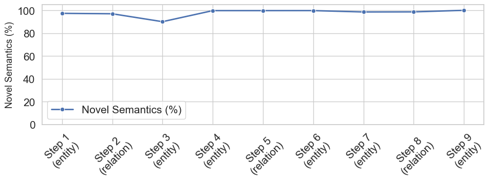

# AutoKG – Generative AI Architectures for Structured Graphs  


AutoKG is a **variational‑autoregressive model** for **multi‑relational knowledge‑graph (KG) generation**.  
On the **IntelliGraphs** benchmark it surpasses classical and modern baselines (TransE, ComplEx, VAE, LDM) on:

* **Validity**
* **Novelty**
* **Compression efficiency**


We also experimented with 
* **graph‑level diversity** and 
* **constrained generation**.


---

## 🔍 Table of Contents
1. [Overview](#overview)
2. [Project Structure](#project-structure)
3. [Quick Start](#quick-start)
4. [Methodology](#methodology)
5. [Evaluation & Results](#evaluation--results)
6. [Datasets](#datasets)

---

## 📌 Overview <a name="overview"/></a>

Generative models have achieved remarkable results in domains like image, text, and video synthesis. However, they continue to struggle with generating coherent symbolic structures such as knowledge graphs (KGs). AutoKG addresses this gap through a novel variational-autoregressive architecture designed to model the full joint distribution over triples. It transforms knowledge graphs into token sequences, enabling latent compression and autoregressive decoding to generate structurally valid, novel, and diverse multirelational graphs. 

In our evaluation, we compared AutoKG against a range of classical and modern generative baselines. 
### 🔬 Baseline Models

As baseline, apart from the models already available from the IntelliGraphs benchmark (**TransE**, **ComplEx**, and **Random**), we also implement a **Variational Autoencoder (VAE)** and a **Latent Diffusion Model (LDM)**.

- **TransE** models relations as a translation in the embedding space and enforces the principle that for each of the valid triples \((h, r, t)\), we have \(h + r \approx t\).
- **ComplEx** embeds relations and entities in the complex domain, helping the model to capture both symmetric and asymmetric patterns in the data.

These methods focus primarily on learning and optimizing a scoring function that is capable of distinguishing plausible from implausible triples. However, a key limitation is that they treat all triples independently of one another.

The **VAE** consists of three components—an **encoder**, a **decoder**, and a **structural decoder**—and learns a latent representation of the entire graph. The decoder predicts entities from the latent vector, and a **RESCAL-based structural decoder** reconstructs the graph by scoring entity pairs for each relation.

In contrast, the **LDM** follows the same encoder–decoder–structural decoder architecture but introduces a **diffusion module** that gradually adds and removes noise in the latent space. The denoising process enables the model to learn a distribution over structured latent representations.

Both VAE and LDM demonstrate the benefits of latent modeling but generate entire graphs in a single step, limiting their ability to capture sequential dependencies.

**AutoKG** addresses this by combining a **variational latent space** with an **autoregressive decoder**, generating triples token-by-token, each conditioned on previous tokens and a latent vector \(z\). This allows AutoKG to achieve **superior performance across all evaluation metrics**.


All models are evaluated on five datasets from **IntelliGraphs** (`syn‑paths`, `syn‑types`, `syn‑tipr`, `wd‑movies`, `wd‑articles`).

---

## 📁 Project Structure <a name="project-structure"/></a>

The repository contains scripts for training and evaluating models on five IntelliGraphs datasets, which include both synthetic (rule-based) and real-world graphs with varying complexity and structure.

```text
.
├── src/
│   ├── autoreg_paths.py        # AutoKG on SYN‑PATHS
│   ├── autoreg_types.py        # AutoKG on SYN‑TYPES
│   ├── autoreg_tipr.py         # AutoKG on SYN‑TIPR
│   ├── autoreg_movies.py       # AutoKG on WD‑MOVIES
│   └── autoreg_articles.py     # AutoKG on WD‑ARTICLES  
├── checkpoints
├── figures
└── …
```

---

## 🚀 Quick Start <a name="quick-start"/></a>

```bash
# 1. install core requirements
pip install -r requirements.txt

# 2. install IntelliGraphs (datasets & helpers)
pip install intelligraphs

# 3. train AutoKG on the Intelligraphs dataset of interest 
python src/autoreg_paths.py        # SYN‑PATHS
python src/autoreg_types.py        # SYN‑TYPES
python src/autoreg_tipr.py         # SYN‑TIPR
python src/autoreg_movies.py       # WD‑MOVIES
python src/autoreg_articles.py     # WD‑ARTICLES
```

Each script  
*loads* the dataset, performs training, and stores checkpoints in `checkpoints/`.

---

## 🧠 Methodology <a name="methodology"/></a>

AutoKG is the first architecture to combine variational inference with autoregressive decoding for multirelational graph generation. Each triple element (subject, predicate, object) is tokenized into a shared vocabulary. The encoder compresses the tokenized graph into a latent vector z, and the decoder generates triple elements sequentially, conditioned on previous tokens and z. This setup allows the model to learn and control long-range dependencies across triples, producing semantically consistent and valid graphs.

### 🏗  AutoKG in one picture  


**AutoKG** is a **variational-autoregressive model** for structured **knowledge graph (KG) generation**.  
It learns to model the **joint probability** over full graphs—not isolated triples—by transforming each graph into a token sequence and decoding it **autoregressively**, conditioned on a **latent vector** `z`.


---

### 1. 🏗️ Architecture Overview

- **Encoder**: Transforms input KG (triples) into a latent vector `z ∈ ℝᵈ` using a Transformer encoder with type-specific token embeddings.
- **Latent Bottleneck**: A variational bottleneck regularized by KL divergence, encouraging compressed global representations.
- **Decoder**: Autoregressively generates tokens `xₜ ∈ {s, p, o}`, conditioned on past tokens and `z` using masked self-attention and cross-attention.
- **Tokenization**: Graphs are serialized into sequences like: [Amsterdam, train_to, Utrecht]

- **Special tokens**: `PAD = 0`, `BOS = 1`, `EOS = 2`  
- **Vocabulary size**: `|V| = 3 + |E| + |R|`  
- **Padding** is used for fixed-length batching.

---

### 3. 🧠 Encoder

- **Transformer encoder layers** capture inter-triple dependencies.
- Latent vector `z` is sampled via reparameterization.

### 4. ✍️ Decoder

- **Masked self-attention** over past tokens
- **Cross-attention** on the latent vector `z`
- Predicts the next token.

### 5. 🎯 Training Objective

AutoKG maximizes the **Evidence Lower Bound (ELBO)**.


### ⚙️  Conditioning Mechanism  

> Give AutoKG a *partial* triple sequence — it will **complete** the graph while respecting constraints.


---

## 📊 Evaluation & Results <a name="evaluation--results"/></a>

Our evaluation spans five datasets from IntelliGraphs. AutoKG achieves state-of-the-art validity and novelty, with near-perfect scores on all datasets. Unlike baselines, AutoKG retains diversity across samples and scales well to complex real-world graphs like wd-articles. Compression analysis confirms that AutoKG learns highly efficient latent representations, outperforming both VAEs and latent diffusion models.


### 1. Compession evaluation and validity and novelty for sampled from the latent space and conditioned on the test set graphs 


  
  
  


### 2. Fine‑grained constraint satisfaction

| Metric | Step‑by‑step behaviour |
|--------|-----------------------|
| **Diversity Ratio** |  |
| **Novel Semantics** |  |

→ Diversity decreases as conditioning increases (expected).

### 3. Compression–Validity trade‑off (synthetic datasets)

| **SYN‑PATHS** | **SYN‑TIPR** | **SYN‑TYPES** |
|---------------|--------------|---------------|
|  |  |  |
|  |  |  |

* KL → 0 at small latent sizes ⇒ information flows through **discrete autoregression** alone.  
* Novelty and validity degrade with wider latents.  

### 4. Diversity ratio
  


---

## 🗂  Datasets <a name="datasets"/></a>

All from **[IntelliGraphs](https://github.com/thiviyanT/IntelliGraphs)**.

| Name          | Type | Entities | Relations | Triples / graph |
|---------------|------|----------|-----------|-----------------|
| syn‑paths     | synthetic | 49  | 3 | ≤ 3 |
| syn‑types     | synthetic | 30  | 3 | ≤ 10 |
| syn‑tipr      | synthetic | 131 | 5 | ≤ 10 |
| wd‑movies     | real‑world | 24 093 | 3 | ≤ 21 |
| wd‑articles   | real‑world | 60 932 | 6 | ≤ 212 |

---